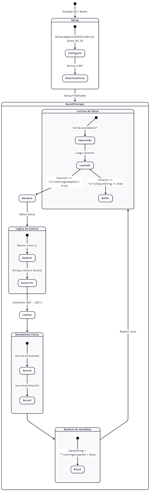

# ⚖️ Smart Balance: Sistema de Control PID con Visión Artificial

> Un sistema embebido de tiempo real capaz de estabilizar una esfera sobre una plataforma móvil mediante retroalimentación visual.

---

## 📖 Descripción del Proyecto

Este proyecto implementa un sistema de control de lazo cerrado tipo **PID (Proporcional-Integral-Derivativo)** para controlar la posición de una pelota sobre una plataforma de 2 grados de libertad.

A diferencia de los sistemas tradicionales que usan paneles táctiles resistivos, este proyecto utiliza **Visión Artificial** externa para detectar las coordenadas $(X, Y)$ de la pelota, transmitirlas vía Serial al **ESP32**, donde un sistema basado en **FreeRTOS** procesa el control y acciona los servomotores.

---

## ⚙️ Arquitectura del Sistema

### 1. Diagrama de Estados del Firmware
El siguiente diagrama describe el comportamiento lógico y el flujo de datos dentro del ESP32:

  

**Descripción de los Estados:**
El firmware opera como una máquina de estados secuencial para garantizar la integridad de los datos:
1.  **Inicio (Setup):** Al encender, el ESP32 configura el puerto serial a 115200 baudios y posiciona los servos en el centro (90°) para evitar movimientos bruscos.
2.  **Espera / Lectura:** El sistema monitorea constantemente el buffer serial. Los caracteres recibidos se acumulan en una cadena temporal hasta detectar un salto de línea (`\n`), lo que indica el fin del paquete.
3.  **Procesamiento:** Una vez completado el paquete (Flag `stringComplete = true`), el sistema separa la cadena buscando la coma (`,`) para diferenciar la coordenada X de la Y.
4.  **Validación y Actuación:** Los valores numéricos obtenidos se restringen (`constrain`) entre 60° y 120° para proteger mecánicamente la plataforma. Finalmente, se envía la señal PWM a los servos y se limpia el buffer para la siguiente lectura.

### 2. Diagrama de Hardware
El sistema se compone de dos bloques principales: el Procesamiento de Imagen (PC/Raspberry) y el Control en Tiempo Real (ESP32).

* **Sensor:** Webcam / Cámara de Smartphone (Procesado con OpenCV).
* **Controlador:** ESP32 DevKit V1.
* **Actuadores:** 2x Servomotores (MG996R o similar).
* **Mecanismo:** Plataforma con articulación universal (Cardan).

### 3. Diseño de Software (FreeRTOS)
Para garantizar la estabilidad del PID, el tiempo de muestreo debe ser determinista. Se utiliza FreeRTOS para orquestar las tareas críticas.

| Tarea | Prioridad | Frecuencia | Descripción |
| :--- | :---: | :---: | :--- |
| **Task_SerialRx** | Alta | Interrupción | Recibe las coordenadas (X,Y) desde la visión artificial. Usa colas para proteger los datos. |
| **Task_PID** | Media | 20-50ms | Calcula el error de posición y la salida del algoritmo PID. |
| **Task_Servo** | Baja | On-Demand | Aplica la señal PWM a los motores basándose en el resultado del PID. |

---

## 🚀 Instalación y Uso

### Requisitos
* **Hardware:** ESP32, Servos, Cámara Web.
* **Software:** Arduino IDE, Python 3.9+, OpenCV (`pip install opencv-python`).

### Pasos
1. **Firmware:**
   - Abrir la carpeta `Codigos` en Arduino IDE.
   - Instalar las librerías necesarias.
   - Cargar el código al ESP32.
2. **Visión:**
   - Conectar la cámara al PC.
   - Ejecutar el script de visión.
3. **Operación:**
   - El sistema iniciará en modo "Calibración". Coloque la pelota en el centro.

---

## 📊 Estado del Proyecto (Avance)

Según la rúbrica de evaluación, el estado actual es:

- [x] **Construcción Mecánica:** Plataforma ensamblada y servos funcionales.
- [x] **Visión Artificial:** Detección de color/forma y obtención de coordenadas X,Y.
- [x] **Comunicación Serial:** El ESP32 recibe correctamente los datos del script de Python.
- [x] **Implementación FreeRTOS:** Tareas creadas y sincronizadas.
- [ ] **Sintonización PID:** Ajuste fino de las constantes Kp, Ki, Kd (En proceso).

---

## 📸 Galería

  
  
  
<em>Montaje final del sistema Ball & Plate</em>

---

## 👥 Autores
* **Marcelo Navarro**
* **Mirko Ayala**
* **Roberto Ayllon**
* **Dayana Andrade**